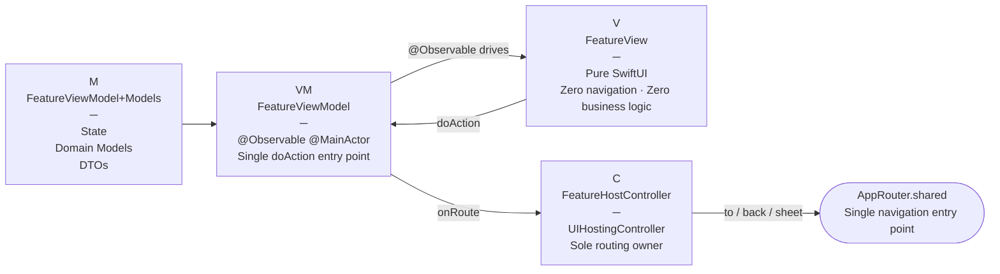
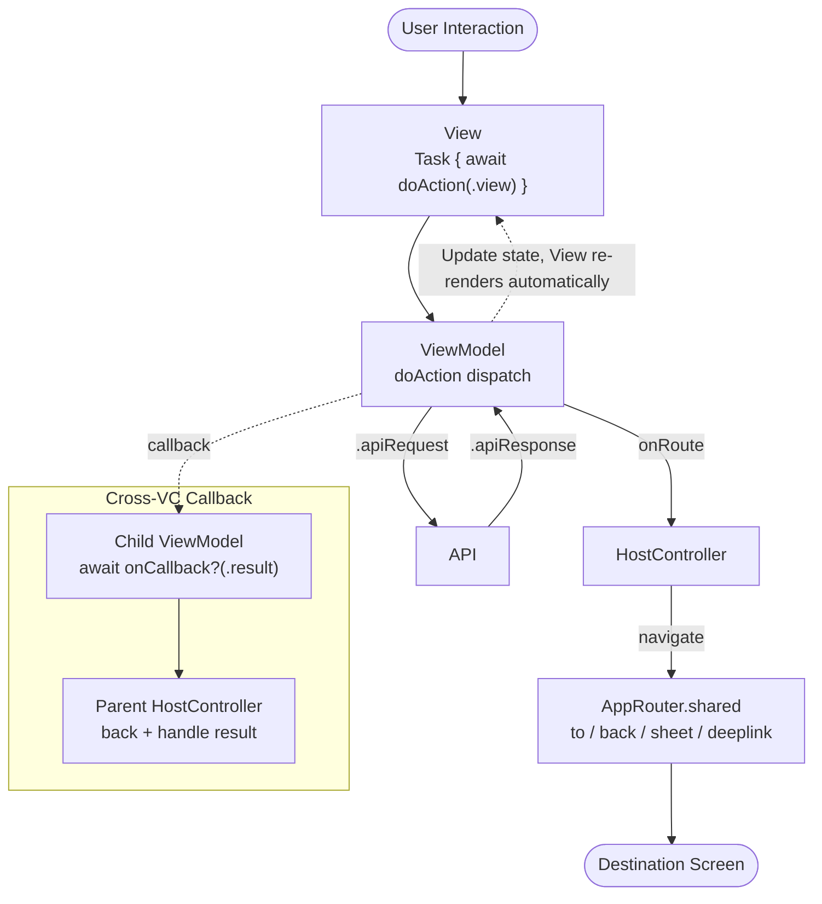

([繁體中文](./README.md)｜English)

# MVVMC

> A navigation architecture pattern designed for SwiftUI + UIKit hybrid iOS apps.

MVVMC extends MVVM with a **HostController (C layer)** to solve the separation-of-concerns problem when SwiftUI runs inside a UIKit navigation environment. Each of the four layers has a strictly defined responsibility — changes in one layer don't affect the others.

---

## Architecture

| Layer | File Naming | Responsibility |
|---|---|---|
| M | `FeatureViewModel+Models.swift` | State / Domain Models / DTOs |
| VM | `FeatureViewModel.swift` | `@Observable @MainActor`, single `doAction` entry point |
| V | `FeatureView.swift` | Pure SwiftUI, zero navigation logic, zero business logic |
| C | `FeatureHostController.swift` | UIKit bridge, sole owner of routing logic |



### Data Flow



---

## AppRouter

`AppRouter.shared` is the single navigation entry point for the entire app. HostControllers never call `navigationController`, `present`, or `dismiss` directly.

```swift
// Push (native swipe-back supported)
AppRouter.shared.to(DetailHostController(...), from: self)
AppRouter.shared.to(FilterHostController(...), from: self, style: .modal)
AppRouter.shared.to(SomeHostController(...), from: self, style: .fade)

// Sheet
AppRouter.shared.sheet(SettingsHostController(...), from: self)
AppRouter.shared.sheet(SomeHostController(...), from: self, detents: [.medium()])

// Back (auto-detects pop vs dismiss)
AppRouter.shared.back(from: self)
AppRouter.shared.backTo(targetVC, from: self)
AppRouter.shared.backToRoot(from: self)

// Tab
AppRouter.shared.tab(1, from: self)

// Deeplink (fullScreen present, auto-injects Close button)
AppRouter.shared.deeplink(SomeHostController(...))
```

---

## Deeplink / Push Notifications

```swift
// Sources/App/Deeplink.swift — URL parsing + VC construction in one place
enum Deeplink {
  case settings
  case postDetail(id: Int)

  init?(url: URL) { ... }

  @MainActor func makeHostController() -> UIViewController { ... }
}

// SceneDelegate — all three entry points call AppRouter.deeplink()
func scene(_ scene: UIScene, openURLContexts URLContexts: Set<UIOpenURLContext>) {
  guard let url = URLContexts.first?.url,
        let deeplink = Deeplink(url: url) else { return }
  AppRouter.shared.deeplink(deeplink.makeHostController())
}
```

Push notification payload convention: `{ "deeplink": "myapp://posts/1" }` — reuses `Deeplink(url:)` directly, no extra parsing logic needed.

---

## MCP Server

This repo ships an MCP server so Claude Code can access MVVMC guidelines from any project.

### Setup

```bash
git clone https://github.com/shinrenpan/MVVMC
cd MVVMC/mcp-server
npm install && npm run build
claude mcp add mvvmc -s user node "$PWD/dist/index.js"
```

### Available Tools

| Tool | Description |
|---|---|
| `get_architecture_overview` | Overall architecture and data flow |
| `get_layer_guide` | Guidelines and examples for a specific layer (M / VM / V / C) |
| `get_approuter_guide` | Full AppRouter API reference |
| `get_deeplink_guide` | Deeplink + Push Notification patterns |

---

## This Repo

| Directory | Purpose |
|---|---|
| `Sources/` | Demo implementation (runnable Xcode project) |
| `mcp-server/` | MCP server source |
| `.claude/skills/` | Claude Code skill guidelines |

### Demo Project

`project.pbxproj` is generated by XcodeGen and excluded from version control. After cloning, run:

```bash
xcodegen generate
open MVVMCDemo.xcodeproj
```

Demo includes:

- **PostList** — Full four-layer implementation: mock API, Router navigation, Filter (modal), UserDetail (fade)
- **PostDetail** — Cross-feature primitive passing, ViewModel assembled in C layer
- **PostFilter** — `onCallback` cross-VC callback example
- **UserDetail** — Fade transition
- **Profile** — Tab navigation (`AppRouter.tab()`)
- **Settings** — Sheet example (`AppRouter.sheet()`)
- **Deeplink Demo** — URL Scheme + Push Notification triggers

---

## Tech Stack

- iOS 17+
- Swift 5.9+ (Swift 6 concurrency compatible)
- SwiftUI + UIKit hybrid
- `@Observable` (Swift Observation framework)
- XcodeGen (`xcodegen generate` to regenerate project file)
